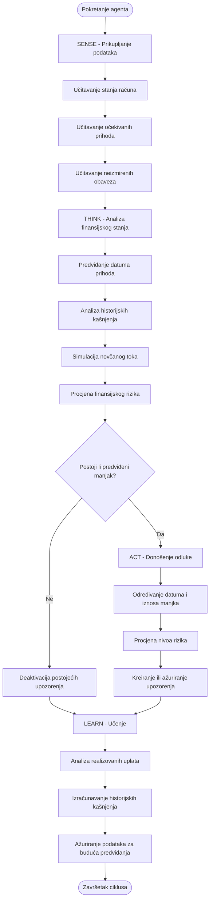

# Dijagram toka rada Personal Finance Agenta

```mermaid
flowchart TD
    A([Pokretanje agenta]) --> B[SENSE - Prikupljanje podataka]

    B --> C[Učitavanje stanja računa]
    C --> D[Učitavanje očekivanih prihoda]
    D --> E[Učitavanje neizmirenih obaveza]

    E --> F[THINK - Analiza finansijskog stanja]

    F --> G[Predviđanje datuma prihoda]
    G --> H[Analiza historijskih kašnjenja]
    H --> I[Simulacija novčanog toka]
    I --> J[Procjena finansijskog rizika]

    J --> K{Postoji li predviđeni manjak?}

    K -->|Ne| L[Deaktivacija postojećih upozorenja]
    K -->|Da| M[ACT - Donošenje odluke]

    M --> N[Određivanje datuma i iznosa manjka]
    N --> O[Procjena nivoa rizika]
    O --> P[Kreiranje ili ažuriranje upozorenja]

    L --> Q[LEARN - Učenje]
    P --> Q

    Q --> R[Analiza realizovanih uplata]
    R --> S[Izračunavanje historijskih kašnjenja]
    S --> T[Ažuriranje podataka za buduća predviđanja]

    T --> U([Završetak ciklusa])
```
